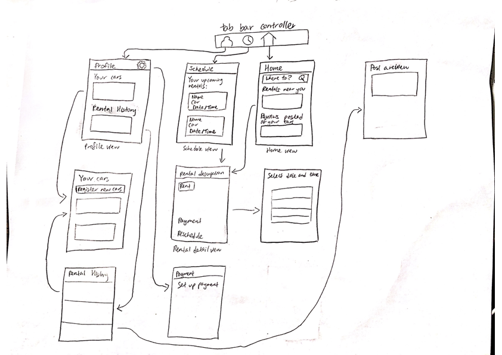

Original App Design Project - README Template
===

# Rent-a-Car

## Table of Contents
1. [Overview](#Overview)
1. [Product Spec](#Product-Spec)
1. [Wireframes](#Wireframes)
2. [Schema](#Schema)

## Overview
### Description
App that allows users to rent or rent-out cars for brief periods of time from people nearby.

### App Evaluation
- **Category:** Travel
- **Mobile:** Allows use of camera and maps.
- **Story:** Allows users to conveniently find transportation on a short day's notice.
- **Market:** Anyone can use this app; must have valid DL; travelers and locals alike can derive value from this app.
- **Habit:** Users are more likely to open and use this app when on vacation, or if not planning to travel as much (two types of users to consider).
- **Scope:** Will start out with the capability to rent/rent out cars and receive a feed of car recommendations (MVP); app can be expanded upon by allowing reviews to be posted and more user-to-user interactions

## Product Spec

### 1. User Stories (Required and Optional)

**Required Must-have Stories**
* User can register car (or register themselves as renter)
* User can login
* User can logout
* User can create new account
* User can view rental schedule
* User can view available rentals close to them (feed)
* User can post a photo of their car
* User can post reviews about their experiences
* User can complete/receive transactions
* User can change app settings
* User can see reviews and cars in timeline feed; view "where to" if currently not in plan, otherwise show location suggestions (or random feed if latter not implemented)

**Optional Nice-to-have Stories**

* User can direct message other users
* User can see suggested locations to travel
* User can view reviews of other profiles
* Car owner can see location of their car
* User can map out routes
* User can rate helpfulness of review (upvote and downvote)

### 2. Screen Archetypes

* Login screen
    * User can login
* Sign up screen
    * User can create new account
* Schedule screen
    * User can view rental schedule
* Settings
    * User can change app settings
* Detail
    * User can view reviews of other profiles
* Stream
    * User can see reviews and cars in timeline feed
* Profile
    * User can view past reviews that they posted
    * User can view registered car(s)
* Search
    * User can search locations and cars

### 3. Navigation

**Tab Navigation** (Tab to Screen)

* Home
* Profile
* Calendar
* Current rides

**Flow Navigation** (Screen to Screen)
* Login screen
    * Home
* Sign up screen
    * Home
* Schedule screen (upcoming rides)
    * Car Detail view
* Settings
    * Profile
* Detail
    * Payment
    * Camera
* Stream
    * Car Detail view
* Profile
    * History screen
* Search
    * Car Detail view

## Wireframes
[Add picture of your hand sketched wireframes in this section]

### [BONUS] Digital Wireframes & Mockups

### [BONUS] Interactive Prototype

## Schema 
### Models
#### Review

   | Property  | Type     | Description |
   | ----------| -------- | ------------|
   | objectId  | String   | unique id for the user review (default field) |
   | author    | Pointer to User| review author |
   | image     | File     | image that user posts |
   | caption   | String   | review content by author |
   | car       | Pointer to Car| car that user is writing about |
   | createdAt | DateTime | date when post is created (default field) |
   | updatedAt | DateTime | date when post is last updated (default field) |
   
#### Car
   | Property  | Type     | Description |
   | ----------| -------- | ------------|
   | objectId  | String   | unique id for the car |
   | images    | Array    | images of the car |
   | caption   | String   | review content by author |
   | author    | Pointer to User| car owner |
   | rate      | String   | price rate of car rental |
   | times     | Array    | date when car will be rented |
   | createdAt | DateTime | date when post is created (default field) |
   | updatedAt | DateTime | date when post is last updated (default field) |

#### User
   | Property  | Type     | Description |
   | ----------| -------- | ------------|
   | objectId  | String   | unique id for the user (default field) |
   | createdAt | DateTime | date when post is created (default field) |
   | updatedAt | DateTime | date when post is last updated (default field) |
  
#### Event
   | Property  | Type     | Description |
   | ----------| -------- | ------------|
   | objectId  | String   | unique id for the event (default field) |
   | createdAt | DateTime | date when post is created (default field) |
   | updatedAt | DateTime | date when post is last updated (default field) |
   | time      | DateTime | date that this rental will occur |
   | rentee    | User     | person who is renting the car |
   | car       | Pointer to Car | car that is being rented |

### Networking
#### List of network requests by screen
- Profile Screen
    - (Read/GET) Query all reviews where user is author
    - (Create/POST) Create a new review object
    - (Create/POST) Create a new car object
    - (Read/GET) Query all events where user is rentee or car owner
- Schedule Screen
    - (Read/GET) Query all events where user is car owner
- Home Screen
    - (Read/GET) Query cars based on certain criteria

#### OPTIONAL: Existing API endpoints
##### Stripe API
